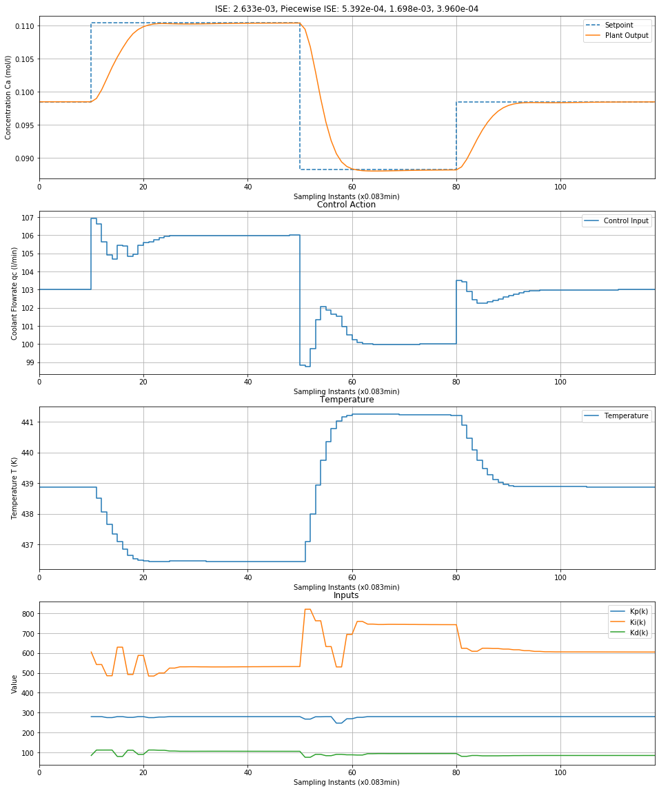
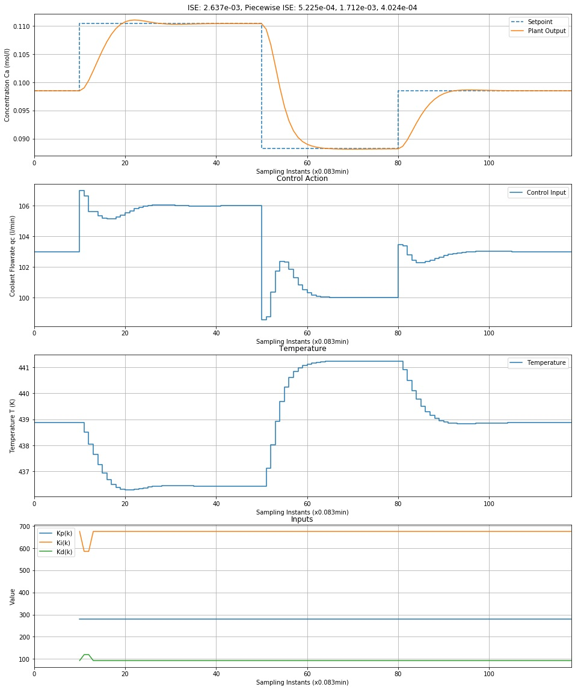

# RL for Controller Tuning

## Usage

Install dependencies using `requirements.txt`

A CSTR system has been implemented along with a Fuzzy PID controller for the same process. The script to train the RL agent to tune the Fuzzy PID is `train_cstr_control.py`. The performance of the trained agent can be evaluated with the accompanying script `test_cstr_control.py`. The entire training and testing pipeline is also available in the `CSTR-Fuzzy.ipynb` notebook.

A PID controller tuned using expert knowledge is available in the the `Paper Reimplementation.ipynb` file. We have compared the performance of the RL Agent vs the expert method in that notebook. The final results are given in the table below. The RL agent achieves competitive performance to the expert method which has complete knowledge of the system parameters.

Two fuzzification techniques have been compared for implementing the Fuzzy PID Controller.

* (Baseline Method) Divide the input space into equally separated regions
* Use the Included Angle method from Control Theory to divide the input space based on the non-linearity of the system in these regions.

|                      |    ISE    | 1st Setpoint (SP) |   2nd SP  |   3rd SP  |
|----------------------|:---------:|:-----------------:|:---------:|:---------:|
| Baseline Model       |           |                   |           |           |
| IMC PID              | 2.626e-03 |     5.766e-04     | 1.706e-03 | 3.437e-04 |
| RL                   | 2.633e-03 |     5.392e-04     | 1.698e-03 | 3.960e-04 |
| Included Angle Model |           |                   |           |           |
| IMC PID              | 3.616e-03 |     7.094e-04     | 2.363e-03 | 5.443e-04 |
| RL                   | 2.637e-03 |     5.225e-04     | 1.712e-03 | 4.024e-04 |

## Performance of the Trained RL Agent

### Baseline Method

### Included Angle

